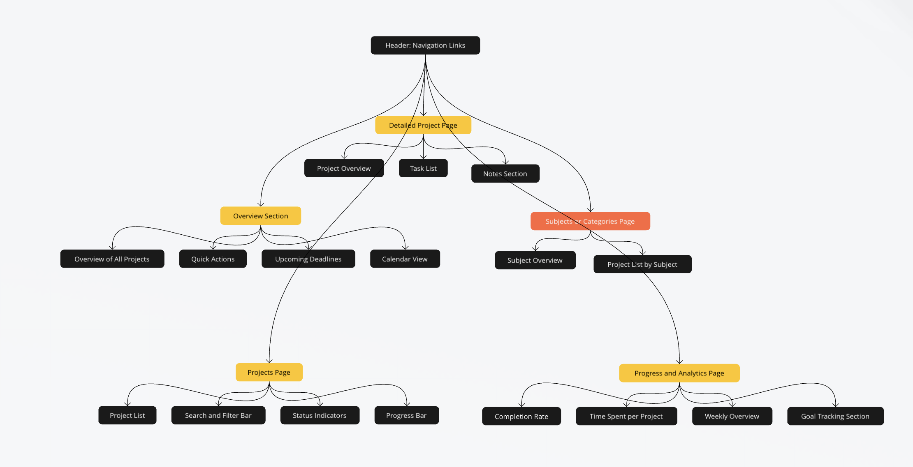

# Web Dev Starter Code

## Project Spec

### *School Project Tracker*

#### **Overview**

For this project I will build a basic application to track projects for students. My project will be designed to help students efficiently organize, manage, and track their academic projects and assignments. This tool aims to provide students with a structured, easy-to-use platform to stay on top of their coursework, deadlines, and project progress. Unlike a general to-do list, the School Project Tracker is specifically tailored to meet the needs of students by breaking down academic projects into manageable tasks, offering deadline reminders, and displaying progress visually to reduce academic stress and improve productivity. This design will help the set up for people using it be less overwhelming ad more motivating!

In today’s digital age, students juggle multiple classes and deadlines, and often need a tool that can centralize all this information in a way that fits their academic needs. This project will leverage AWS for data management, allowing students to store, retrieve, and manipulate their project data seamlessly.

#### **Theme**

The general theme of this project is academic productivity and project management. This project will be built specifically for students projects. The platform will address the common issues that students face, such as forgetting deadlines, managing multiple assignments, and tracking their progress. By offering a clear and organized space for each project. THis will empower students to manage their workload effectively and stay on top of their assignments throughout the academic term.

This theme is particularly relevant as many students rely on digital tools to enhance their learning experience. By focusing on an application that addresses these unique academic needs, the project will serve as a useful, real-world solution that brings together multiple aspects of web development, including form handling, data storage, and user experience.

#### **Project Functionality**

Below is some of the parts of this website/tool that I would like to implement. These are all ideas I will be reaching for and mixing and matching, or potentially adding to!

1. *Dashboard*

The Dashboard would serve as the central hub for all of the assignments, providing an overview of academic progress and key metrics. People can see a high-level summary of their current workload, upcoming deadlines, and project statuses.

- Overview of All Projects: The dashboard will display a summary of active, completed, and upcoming projects. Each project will have a progress indicator, such as a progress bar, to visually represent how close it is to completion.
- Quick Actions: The dashboard will feature buttons to quickly add new projects, mark projects as complete, or view overdue projects. These quick actions enhance user productivity by allowing students to manage projects directly from the dashboard.
- Upcoming Deadlines Widget: This widget lists projects with the nearest deadlines, sorted by due date. This feature allows students to prioritize tasks and stay aware of approaching deadlines, helping them avoid last-minute stress.

2. *Projects/Assignments Page*

The Projects/Assignments Page would provide a detailed view of all active projects, allowing students to search, filter, and manage their assignments. This page is designed for quick and intuitive navigation, making it easy for students to stay organized.

- Project List: Each project appears as a card or row, displaying essential details such as title, due date, subject, and status (e.g., “In Progress,” “Completed”). This layout allows students to see their workload in a straightforward, visually accessible format.
- Search and Filter: Students can filter projects by subject, due date, or status, and use a search bar to quickly locate specific projects. These features simplify navigation, making it easy to manage projects across different subjects or prioritize based on deadline urgency.
- Status Indicators: Color-coded status indicators quickly communicate a project’s current state. For example, red might represent overdue projects, green for completed, and yellow for projects on track. This color-coded system allows students to see the urgency of tasks at a glance.
- Progress Tracking: Each project will have a progress bar, helping students visualize their advancement on each assignment. This feature is essential for monitoring long-term projects or multi-step assignments, allowing students to break down work into achievable milestones.

3. *Detailed Project Page*

The Detailed Project Page would offer an in-depth view of each assignment, breaking down the project into tasks and enabling students to manage their workflow efficiently. This page will also include features that help students organize resources and track specific project details.

- Project Overview: The overview section displays key project information, such as the title, subject, due date, and estimated time for completion. This summary gives students a clear understanding of the assignment's requirements at a glance.
- Task List: Students can break down each project into smaller tasks (like “Research,” “Outline,” “Draft,” “Revise”) and mark tasks as complete as they progress. This task list provides a structured approach to assignments, making large projects feel manageable and encouraging consistent progress.
- Notes Section: A dedicated notes section allows students to jot down important ideas, resources, or observations related to the project. This feature enables students to keep relevant information organized and easily accessible.

4. *Subjects or Categories Page*

The Subjects or Categories Page could organize projects by academic subject or category or in a lot of other ways! This page would offer an overview of projects across different subjects, allowing students to see their workload distribution.

- Organize by Subject or Category: Projects can be categorized based on subjects like Math, History, or Science. This classification system allows students to view and manage assignments by academic area, making it easy to focus on a specific subject’s workload.
- View All Projects in Each Subject: Clicking on a subject/category displays all related projects, providing a clear overview of tasks within that area. This view helps students assess the scope of work within each subject and allocate time accordingly.
- Statistics by Subject: Charts or progress meters display data such as the number of projects completed per subject or average grades. This feature provides insights into a student’s academic progress and strengths, helping them identify areas for improvement or subjects that may need more attention.

5. *Progress and Analytics*

The Progress and Analytics section offers my favorite part about my set up. It can show metrics about specific assignments, classs, topics, etc. Here are a few ideas I may consider, and I have a few more I may end up playing with.

- Completion Rate: A visual indicator, such as a pie or bar chart, shows the percentage of completed versus pending projects. This completion rate motivates students to finish assignments and provides a satisfying visual representation of their progress.
- Time Spent per Project: If students wish to track time, this feature displays how much time has been dedicated to each project. This information can help students identify time-consuming tasks and manage their study hours more effectively.
- Weekly Overview: A weekly overview displays the number of projects completed within the week, helping students visualize their productivity and encouraging them to maintain a consistent workflow.

#### **Target Audience**

The primary target audience is students. This includes high school, undergraduate, and graduate students who often need to manage several projects across different classes simultaneously. Students in any academic field or major will benefit from this tool, as the application is designed to be flexible enough to handle a variety of project types and academic requirements.

The tool can also be valuable for any users involved in structured learning, such as people taking online courses or professional certifications. While the primary audience is students, the application is versatile enough to support any learning environment that requires project tracking and deadline management.

#### **Data Management**

Once the main functionality is implemented, several additional features could enhance the application’s utility and user experience. All project data, reminders, and task progress will be securely stored using AWS services. AWS will manage data storage, retrieval, and file handling, ensuring data reliability and security. This architecture ensures that user data is securely stored and efficiently managed.

#### **Stretch Goals**

Once the main features are fully implemented, the following stretch goals could be added to further improve the application’s usability and provide a more personalized, insightful experience:

- Advanced Analytics:
    - Detailed Productivity Insights: Provide students with analytics on their productivity trends, such as a weekly summary of tasks completed, average time spent on each project, and projects per subject.
    - Time Management Insights: Show users their busiest days and peak working hours based on when they update or complete tasks, helping them optimize study time.
    - Completion Metrics: Include metrics like average project completion times, overdue rates, and percentage of assignments completed before the due date, offering students useful insights into their time management skills.
- Enhanced User Experience Features:
    - Quick Add Feature: Add a quick-add option on the dashboard for students to input tasks or project updates without navigating to different pages.
    - Recent Activity Section: Display a recent activity feed that shows the latest updates, such as new tasks added or completed, to help students keep track of their recent progress.
    - Keyboard Shortcuts: Introduce keyboard shortcuts for common actions (like adding a project or marking a task as complete), providing a faster, more efficient workflow.
- Personalization Options:
    - Custom Themes and Color Options: Allow users to choose from a few preset themes or custom colors for the interface, making the platform more engaging and visually suited to each user’s preferences.
    - Dark Mode: Add a dark mode option to reduce eye strain, especially for students working at night.
    - Profile Customization: Enable students to upload a profile picture, set academic details (like major or year), and save preferences for reminders and notifications.

This project demonstrates a well-rounded approach to web development, encompassing both back-end data management and front-end user interaction. The planned features and stretch goals aim to create a functional, user-friendly application that will address students' real-world needs and help them manage their academic workload more effectively.

## Project Wireframe

